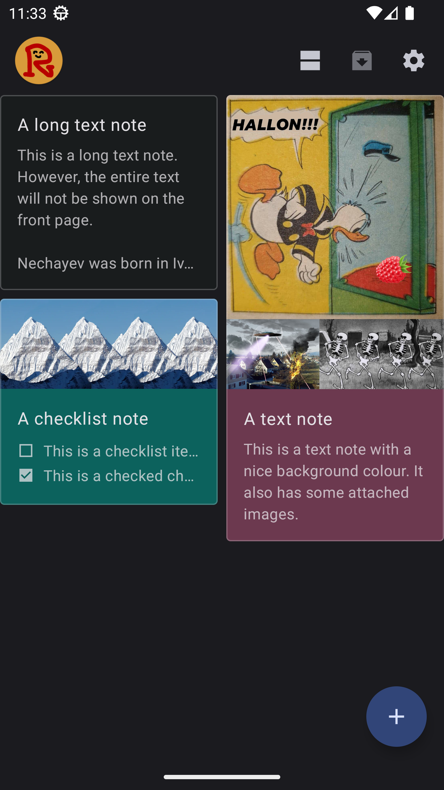
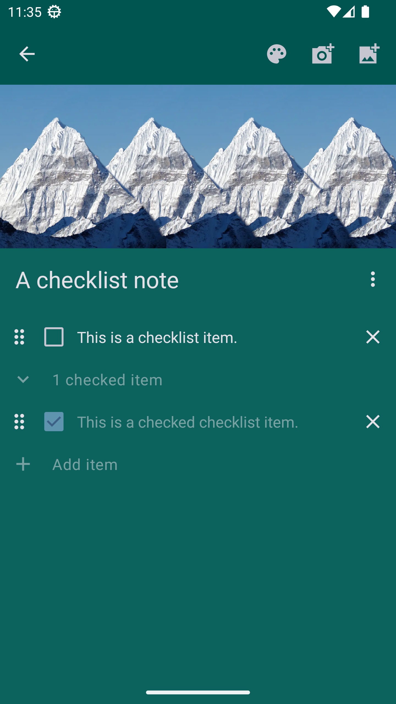
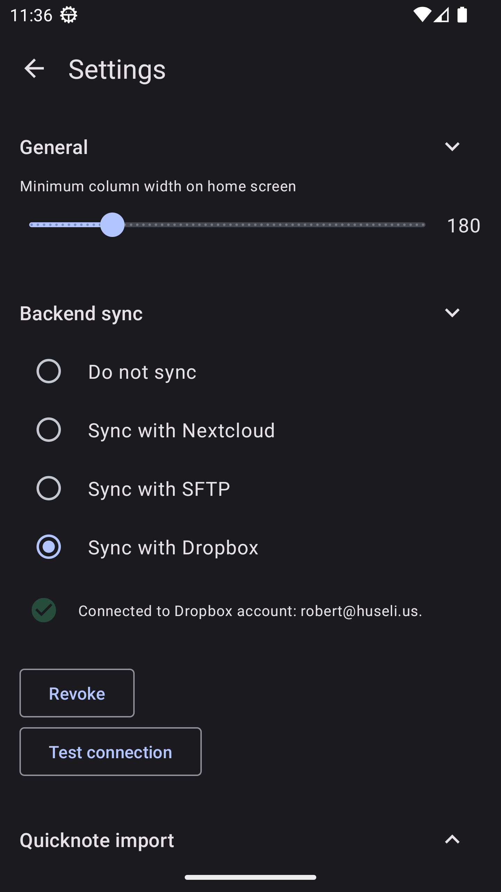

# Retain

It's a note/checklist app. Heavily inspired by Google Keep, except it's not evil (i.e. open source, doesn't track you, and doesn't work towards concentrating all the world's wealth in the hands of a a few delusional narcissists). You can sync your notes to a Nextcloud, SFTP, or Dropbox account if you so desire.

Not yet available on any appstores etc. But it will probably come. Just take it easy! In the meantime, there should probably be an .apk available under [app/release](app/release).

|  |  |  |
|---|---|---|
